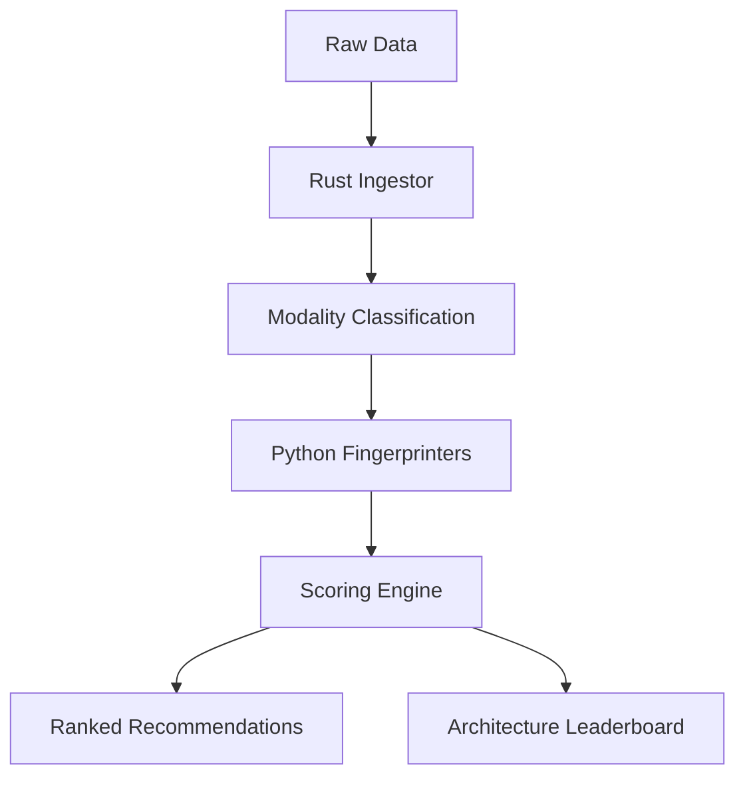
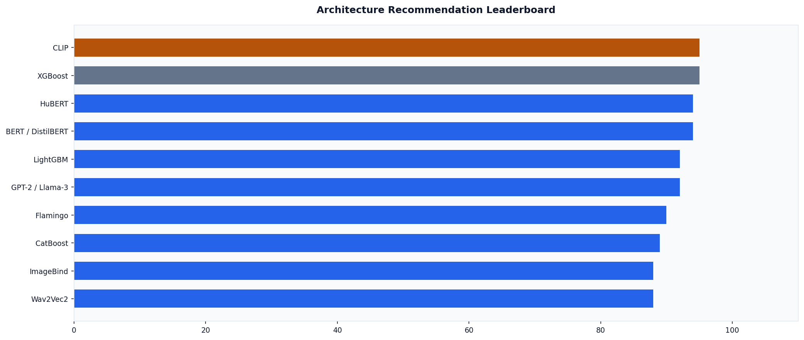
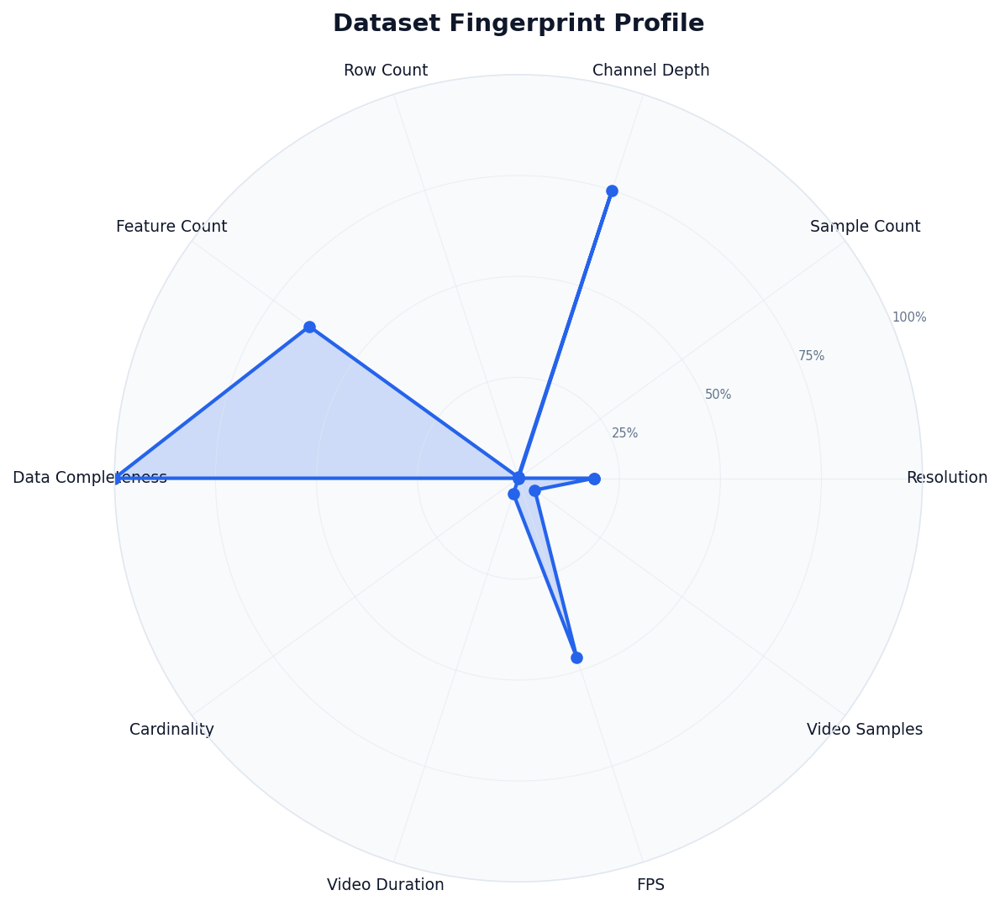

# DataSense

**Multimodal Architecture Advisor**

DataSense analyzes raw datasets across image, audio, video, tabular, and mixed modalities, extracts a structured fingerprint, and recommends the best ML architecture before you train a single model.

## Problem

Current tools either train first and then tell you what worked (AutoML), or require you to already know your architecture (vanilla ML pipelines). No tool analyzes raw multimodal data and explains architecture fit before training, especially across diverse or mixed datasets.

## How It Works



1. **Ingest**: A Rust-based file walker scans directories and classifies files by modality using fast signature matching.
2. **Fingerprint**: Python modules extract architecture-relevant signals (resolution, sample rates, missing data, temporal density).
3. **Score**: A rule-based engine evaluates 20+ architectures and ranks them based on dataset fit.
4. **Recommend**: Results are presented as a ranked leaderboard with fit scores and plain-language justifications.

## Usage

**Analyze a dataset and get a primary recommendation:**
```bash
cargo run -- analyze path/to/dataset/
```

**Generate a professional Document report (Light Theme):**
```bash
cargo run -- analyze path/to/dataset/ --plot --report analysis.docx
```

**Rank all candidate architectures with visual plots:**
```bash
cargo run -- score path/to/dataset/ --plot
```

**Generate a training blueprint (boilerplate code) for the best fit:**
```bash
cargo run -- init path/to/dataset/ --output training_script.py
```

**Launch the interactive terminal dashboard:**
```bash
cargo run -- dashboard path/to/dataset/
```

## AI Intelligence Setup

DataSense supports deep architectural reasoning powered by state-of-the-art LLMs. By providing an API key, you can transform the advisor into a research-empowered consultant.

### 1. Configuration (`.env`)
Create a `.env` file in the root directory (copy from `.env.example`):

```bash
# Choose your provider: groq, openai, anthropic, grok, or moonshot
AI_PROVIDER=groq
AI_API_KEY=your_api_key_here
AI_MODEL=groq/compound-mini
```

### 2. Supported Providers

| Provider | Recommended Model | Capability |
|:---|:---|:---|
| **Groq** | `groq/compound-mini` | **Research Enabled**: Web search, code execution, LPU-optimized. |
| **OpenAI**| `gpt-4o` | High-fidelity general architectural reasoning. |
| **Anthropic**| `claude-3-5-sonnet-latest` | Expert-level technical justifications. |
| **Moonshot** | `kimi-v1-8k` | High-performance reasoning for complex data signatures. |
| **Grok** | `grok-2` | OpenAI-compatible high-performance reasoning. |

### 🛠️ Strategic Reasoning
When an AI provider is active, DataSense generates a **Executive Summary & Reasoning** panel in the dashboard. This summary uses your selected model to analyze the cross-modal interaction of your specific dataset and justify why the top-ranked architecture is the current industry gold standard.

*Note: If no API key is provided, DataSense seamlessly falls back to its robust, rule-based expert system.*

## Visual Insights

DataSense provides high-clarity **Sapphire Blue** charts and professional document outputs.

#### Sample Reports
Experience the full output spectrum by exploring our [samples/](samples/) directory:
- [Video Analysis (Markdown)](samples/video_analysis.md)
- [Video Analysis (PDF)](samples/video_analysis.pdf)
- [Video Analysis (DOCX)](samples/video_analysis.docx)
- [Video Analysis (TXT)](samples/video_analysis.txt)

#### Architecture Leaderboard (Light Theme)


#### Dataset Fingerprint Radar (Light Theme)


## Example Output

### Ranked Architecture Leaderboard

| Rank | Fit Score | Model | Justification |
|:---:|:---:|:---|:---|
| 🥇 1 | 95% | **CLIP** | Industry standard for image-text alignment and zero-shot tasks. |
| 🥈 2 | 95% | **XGBoost** | Best for high-cardinality categorical data with missing values. |
| 🥉 3 | 92% | **TimeSformer** | Divided space-time attention for complex video understanding. |
| 4 | 90% | **Flamingo** | Powerful multi-modal LLM for visual question answering. |
| 5 | 88% | **Swin Transformer** | Shifted-window attention for multi-scale spatial data. |

### Video Modality Profile
```bash
cargo run -- score test_dataset/video
```
```
DataSense — Architecture Leaderboard
Detected Video: 5 samples

Rank | Score | Model            | Justification
-----|-------|------------------|--------------------------------------------------
🥇1  | 92%   | TimeSformer      | Divided space-time attention for complex video.
🥈2  | 90%   | SlowFast         | Dual-pathway design captures slow and fast motion.
🥉3  | 88%   | X3D              | Efficient expansion across spatial and temporal dims.
 4   | 87%   | VideoMAE         | Self-supervised pretraining for limited labeled data.
```

## Supported Modalities

| Modality | Fingerprint Signals | Format Support |
|:---|:---|:---|
| **Image** | Resolution, color channels, spatial complexity | png, jpg, jpeg, webp, bmp |
| **Audio** | Sample rate, duration, temporal density | wav, mp3, flac, ogg |
| **Video** | FPS, clip length, frame statistics | mp4, avi, mov, mkv |
| **Tabular**| Missing rate, cardinality, feature types | csv, parquet, jsonl |
| **Mixed**  | Modality dominance, alignment, cross-modal ratios | Any combination |

### Specialized Problem Detection

DataSense doesn't just classify data; it identifies complex ML tasks based on cross-modal signals:

- **ASR (Auto Speech Recognition)**: Triggered when Audio + Text pairs are detected. Recommends architectures like **Whisper**.
- **RL (Reinforcement Learning)**: Identified in highly sparse or sequential Tabular datasets. Recommends agents like **PPO**.
- **TTS (Text-to-Speech)**: Suggested when high-quality Text + Audio alignments are found.

## Design Decisions

- **Rust + Python hybrid**: Rust handles high-speed ingestion (5ms traversal). Python handles ML analysis (numpy, pandas, opencv) where the ecosystem is mature.
- **Rule-based Scoring**: Architecture selection follows explainable heuristics. No black-box "model for models" required.
- **Explainable AI**: Every recommendation comes with a plain-language "Why" to help developers understand the fit.

## Benchmark

| Dataset | Modalities | Command | Time (M1 Pro) |
|:---|:---|:---|:---|
| Mixed (Tabular + Image) | 2 Modalities | `analyze` | 1.2s |
| Video (5 Clips) | Video | `score` | 1.1s |
| Tabular (300k Rows) | Tabular | `score --model` | 1.1s |

## License
Apache-2.0
