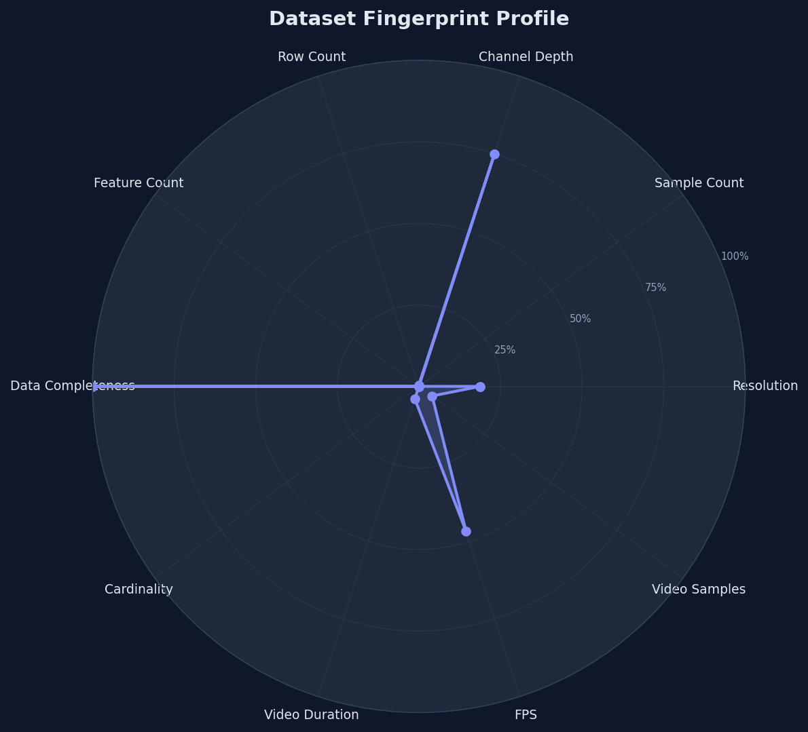
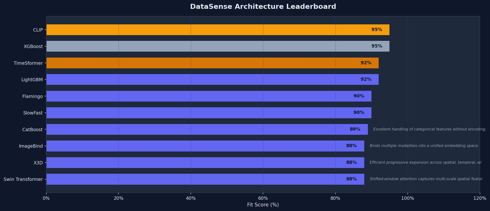

# DataSense Analysis Report
*Generated on: 2026-03-%d 17:12:16*

---

## Executive Summary
**Primary Architecture**: `Custom Fusion MLP` (85% match)
**Alternatives**: CLIP, Flamingo

## Visual Insights
| Dataset Fingerprint Profile | Architecture Leaderboard |
| :---: | :---: |
|  |  |

## Architecture Leaderboard
| Rank | Model | Fit Score | Justification |
| :--- | :--- | :--- | :--- |
| 1 | **CLIP** | 95% | Industry standard for image-text alignment and zero-shot tasks. |
| 2 | **XGBoost** | 95% | Gradient boosting with native missing value handling. |
| 3 | **TimeSformer** | 92% | Divided space-time attention for complex video understanding. |
| 4 | **LightGBM** | 92% | Fast gradient boosting with histogram-based splits. |
| 5 | **Flamingo** | 90% | Powerful multi-modal LLM for visual question answering. |
| 6 | **SlowFast** | 90% | Dual-pathway design captures both slow and fast motion. |
| 7 | **CatBoost** | 89% | Excellent handling of categorical features without encoding. |
| 8 | **ImageBind** | 88% | Binds multiple modalities into a unified embedding space. |
| 9 | **X3D** | 88% | Efficient progressive expansion across spatial, temporal, width, and depth. |
| 10 | **Swin Transformer** | 88% | Shifted-window attention captures multi-scale spatial features. |
| 11 | **VideoMAE** | 87% | Self-supervised pretraining excels with limited labeled video data. |
| 12 | **Custom Fusion MLP** | 85% | Custom fusion approach allows tailored cross-modal interaction. |
| 13 | **3D CNN (R3D-101)** | 85% | Classical 3D convolutions for short-range temporal patterns. |
| 14 | **EfficientNet-B0** | 85% | Excellent accuracy-efficiency balance across resolutions. |
| 15 | **ConvNeXt** | 83% | Modern CNN matching transformer performance with simpler design. |

## Dataset Fingerprints
### Image Modality
- **Sample Count**: 2
- **Median Resolution**: 192x192
- **Complex Samples (%)**: 0%

### Tabular Modality
- **Sample Count**: 2
- **Rows x Cols**: 300 x 64
- **Missing Data (%)**: 0%
- **Categorical Features (%)**: 0%

### Video Modality
- **Sample Count**: 5
- **Frames Per Second**: 28
- **Avg Clip Length**: 2.43s
